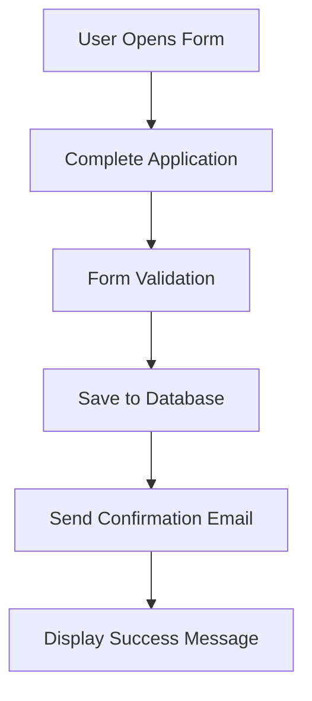

# 📝 Django Job Application Form


A web-based job application system built with **Django**, **Bootstrap**, and **SQLite**. Applicants can submit their personal information, availability date, and employment status through a responsive form. Submitted applications are stored in a database and a confirmation email is sent to the applicant.

---

## 📌 Features

- Collect applicant information through a web form
- Store submissions in a SQLite database using Django Models
- Send confirmation emails after successful submission
- Display success messages to users
- Responsive Bootstrap UI
- Django ORM integration
- Form validation using Django Forms
- Easy-to-extend project structure

---

## 🛠️ Technologies Used

| Technology | Purpose |
|------------|---------|
| Python | Backend programming |
| Django | Web framework |
| SQLite | Database |
| Bootstrap 5 | Frontend styling |
| HTML5 | User interface |
| Django ORM | Database operations |
| Django Messages | User notifications |

---

## 📂 Project Structure

```text
job_application/
│
├── models.py
├── views.py
├── forms.py
├── templates/
│   └── index.html
│
mysite/
│
├── settings.py
├── urls.py
│
manage.py
```

---

## 🗄️ Database Model

```python
class Form(models.Model):
    first_name = models.CharField(max_length=80)
    last_name = models.CharField(max_length=80)
    email = models.EmailField()
    date = models.DateField()
    occupation = models.CharField(max_length=80)
```

### Stored Information

| Field | Description |
|---------|------------|
| First Name | Applicant's first name |
| Last Name | Applicant's last name |
| Email | Applicant's email address |
| Date | Available start date |
| Occupation | Current employment status |

---

## 🖥️ User Interface

The application provides a responsive Bootstrap form where users can:

- Enter first and last name
- Provide an email address
- Select an available start date
- Choose employment status:
  - Employed
  - Unemployed
  - Self-Employed
  - Student

After submission:

✅ Application data is stored in the database

✅ Confirmation email is sent

✅ Success message is displayed

---

## ⚙️ Installation & Setup

### 1. Install Django

```bash
pip install django
```

### 2. Create a Django Project

```bash
django-admin startproject mysite .
```

### 3. Create the Application

```bash
python manage.py startapp job_application
```

### 4. Register the App

Add `job_application` to `INSTALLED_APPS` inside `settings.py`:

```python
INSTALLED_APPS = [
    'django.contrib.admin',
    'django.contrib.auth',
    'django.contrib.contenttypes',
    'django.contrib.sessions',
    'django.contrib.messages',
    'django.contrib.staticfiles',
    'job_application',
]
```

### 5. Create Database Migrations

Generate migration files:

```bash
python manage.py makemigrations
```

Apply migrations:

```bash
python manage.py migrate
```

### 6. Run the Development Server

```bash
python manage.py runserver
```

Visit:

```text
http://127.0.0.1:8000/
```

---

## 📧 Email Notifications

After a successful submission, the application sends a confirmation email to the applicant.

Example:

```text
Subject: Form Submission Confirmation

A new job application was submitted.
Thank you, John.
```

Configure email settings in `settings.py`:

```python
EMAIL_HOST = "smtp.gmail.com"
EMAIL_PORT = 587
EMAIL_USE_TLS = True
EMAIL_HOST_USER = "your_email@gmail.com"
EMAIL_HOST_PASSWORD = "your_password"
```

---

## 🔄 Application Workflow



---

## 🚀 Future Improvements

- Resume/CV uploads
- Admin dashboard for recruiters
- Applicant tracking system
- Search and filter applications
- PostgreSQL support
- User authentication
- Email templates with HTML formatting
- Application status tracking

---

## 📚 What I Learned

This project helped reinforce:

- Django project architecture
- Models and ORM
- Form validation
- Database migrations
- Email integration
- Bootstrap styling
- Template rendering
- Django Messages Framework

---

## 📸 Screenshot

Add screenshots here after deployment:

```md

```

---

## 📄 License

This project is licensed under the MIT License.

---

## 👨‍💻 Author

Built as a Django learning project focused on:

- Web Development
- Database Integration
- Form Processing
- Email Automation
- Django Best Practices

⭐ If you found this project helpful, consider starring the repository.
